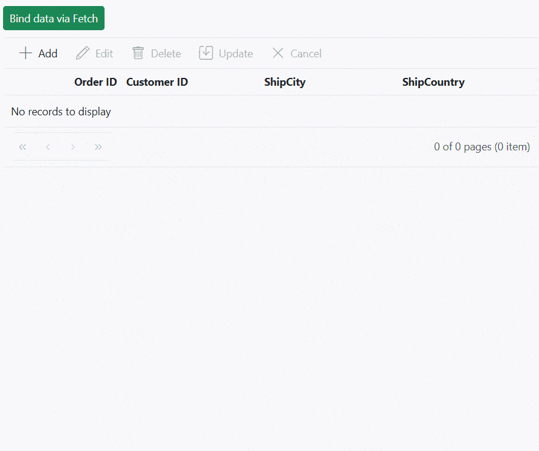

# Binding data and perform action in ej2 typescript grid using Fetch request

This repository demonstrates the integration of the Syncfusion EJ2 Grid with external data sources using Fetch requests. The Syncfusion Grid provides a seamless way to bind data from external sources, facilitating CRUD (Create, Read, Update, Delete) operations with data retrieved from a server. This feature is particularly valuable for sending data to a server for database updates and asynchronously retrieving data without refreshing the entire web page.

## Features

**Asynchronous Data Binding:** Bind data from external sources using Fetch API.

**CRUD Operations:** Implement Create, Read, Update, and Delete operations.

## Prerequisites

Before you begin, ensure you have met the following requirements:

* Node.js and npm installed

* Basic knowledge of Typescript and web development

## Getting Started

**1. Clone the Repository:**

Use `git clone` to fetch the repository from GitHub.

```bash
https://github.com/SyncfusionExamples/Binding-data-and-perform-action-in-ej2-typescript-grid-using-Fetch-request.git

```

**2. Open and Build the Project:**

* Open the project in Visual Studio.
* Build the project to restore dependencies and compile it.
* Run the project

**3. Explore the Code:**

* Navigate to Typescript files (typically in src or scripts).
* Debug and interact with the code as needed.



## Resources

You can also refer the below resources to know more details about Syncfusion Typescript Grid components.

* [Demo](https://ej2.syncfusion.com/demos/#/bootstrap/grid/over-view)
* [Documentation](https://ej2.syncfusion.com/documentation/grid/getting-started)

